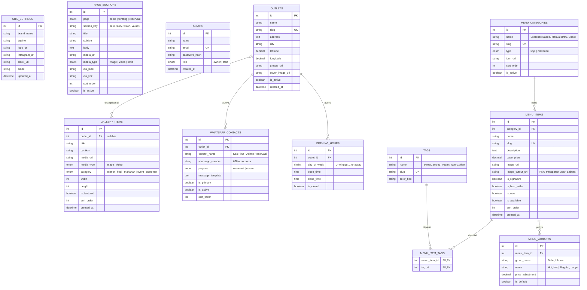

# ERD — BREWI JAYA ☕

Entity Relationship Diagram untuk landing page **Brewi Jaya**, coffee shop dengan target pembeli Gen Z.

Cakupan fase 1: **Home, Tentang, Reservasi, Gallery, Menu (Kopi & Makanan), Lokasi**, ditambah panel admin sederhana untuk mengelola konten.

> **Reservasi tidak memakai formulir.** Tombol reservasi langsung membuka chat WhatsApp ke kontak yang sudah ditentukan, lengkap dengan nama kontak dan pesan pembuka otomatis.

---

## 1. Diagram



`ADMINS` berdiri sendiri karena hanya dipakai untuk login panel admin (mengelola menu, gallery, konten, dan kontak WA).

---

## 2. Pemetaan Halaman ke Tabel

Landing page berupa satu halaman panjang (one page scroll). Urutan section dari atas ke bawah:

| Urutan | Section | Tabel yang dipakai | Keterangan |
|---|---|---|---|
| 1 | **HOME** | `page_sections` (page = home), `menu_items` (is_signature / is_best_seller), `site_settings` | Hero, highlight menu andalan, link sosmed |
| 2 | **TENTANG** | `page_sections` (page = tentang) | Cerita brand, visi, values, disusun per section agar mudah dianimasikan saat scroll |
| 3 | **MENU** | `menu_categories` (type = kopi / makanan), `menu_items`, `menu_variants`, `tags`, `menu_item_tags` | Tab Kopi dan Makanan, filter tag, pilihan varian |
| 4 | **GALLERY** | `gallery_items` | Filter per kategori; `width`/`height` untuk layout tanpa lompatan |
| 5 | **LOKASI** | `outlets`, `opening_hours` | Peta (lat/long), tombol Google Maps, jam buka hari ini |
| 6 | **RESERVASI** | `page_sections` (page = reservasi), `whatsapp_contacts` (purpose = reservasi), `opening_hours` | Section penutup: CTA besar "Reservasi via WhatsApp" dengan nama kontak, tanpa formulir |

Tombol "Reservasi" di navbar melakukan smooth scroll ke section terakhir ini.

### Dukungan data untuk animasi scroll

| Efek | Section | Kolom pendukung |
|---|---|---|
| Section bertumpuk (overlapping / stacking) | Semua section | `page_sections.sort_order` menentukan urutan tumpukan |
| Foto bergerak ke samping (horizontal scroll) | Menu, Gallery | `menu_items.image_cutout_url`, `gallery_items.sort_order`, `width`/`height` |
| Animasi kopi tumpah / Lottie | Home, Tentang | `page_sections.media_type = lottie`, `media_url` |
| Badge muncul saat scroll | Menu | `is_signature`, `is_best_seller`, `is_new` |

---

## 3. Alur Reservasi via WhatsApp

1. Pengunjung membuka halaman Reservasi dan melihat info jam buka serta kartu kontak (misalnya "Kak Rina — Admin Reservasi").
2. Pengunjung menekan tombol **Reservasi via WhatsApp**.
3. Frontend membentuk link dari `whatsapp_number` dan `message_template`:

```
https://wa.me/628123456789?text=Halo%20Kak%20Rina%2C%20saya%20mau%20reservasi%20di%20Brewi%20Jaya...
```

4. WhatsApp (aplikasi di HP atau WhatsApp Web di laptop) terbuka dengan pesan yang sudah terisi, lalu reservasi dilanjutkan langsung lewat chat.

Contoh isi `message_template`:

```
Halo {contact_name}, saya mau reservasi di Brewi Jaya {outlet_name} 👋
Nama:
Tanggal:
Jam:
Jumlah orang:
```

Placeholder `{contact_name}` dan `{outlet_name}` diganti oleh frontend sebelum teks di-encode dengan `encodeURIComponent`.

---

## 4. Penjelasan Tabel

### `site_settings`
Hanya berisi 1 baris. Menyimpan identitas brand dan link sosial media yang muncul di navbar dan footer.

### `page_sections`
Konten Home, Tentang, dan Reservasi dibuat per section (hero, story, vision, dan seterusnya), sehingga setiap section bisa punya animasi scroll sendiri di frontend. Kolom `media_type` mendukung `lottie` untuk animasi seperti kopi tumpah.

### `admins`
Akun pengelola konten. `owner` bisa mengelola semuanya termasuk kontak WA, `staff` fokus ke update menu dan gallery.

### `outlets` dan `opening_hours`
Satu outlet punya 7 baris jam buka (satu per hari). Dirancang sudah mendukung banyak cabang walau saat ini baru satu.

### `whatsapp_contacts`
Kontak WA yang ditampilkan di website. `contact_name` ditampilkan di tombol dan dipakai di sapaan pesan, `whatsapp_number` disimpan dalam format `62xxxxxxxxxx` (tanpa `+`, spasi, atau angka 0 di depan). `is_primary` menandai kontak utama yang dipakai untuk tombol reservasi di navbar atau floating button. Karena berupa tabel terpisah, admin bisa mengganti nomor atau menambah kontak kedua (misalnya untuk shift malam) tanpa mengubah kode.

### `menu_categories`
Kolom `type` membagi kategori menjadi **kopi** dan **makanan**, yang menjadi dua tab utama di halaman Menu.

### `menu_items`
Item menu. `image_cutout_url` adalah foto produk PNG transparan, cocok untuk animasi gelas yang melayang atau bergeser ke samping saat scroll. Flag `is_signature`, `is_best_seller`, dan `is_new` dipakai untuk badge.

### `menu_variants`
Varian dengan penyesuaian harga, dikelompokkan lewat `group_name`. Contoh: Suhu (Hot +0, Iced +3000), Ukuran (Regular +0, Large +5000).

### `tags` dan `menu_item_tags`
Relasi many-to-many untuk label seperti "Sweet", "Strong", atau "Non-Coffee", dipakai sebagai chip filter.

### `gallery_items`
Foto atau video gallery. `outlet_id` boleh kosong untuk konten umum.

---

## 5. Relasi

| Relasi | Kardinalitas | Aturan hapus |
|---|---|---|
| outlets → opening_hours | 1 : N | CASCADE |
| outlets → whatsapp_contacts | 1 : N | CASCADE |
| outlets → gallery_items | 0..1 : N | SET NULL |
| menu_categories → menu_items | 1 : N | RESTRICT |
| menu_items → menu_variants | 1 : N | CASCADE |
| menu_items ↔ tags | N : M (via menu_item_tags) | CASCADE |

---

## 6. Aturan Bisnis dan Validasi

1. `whatsapp_number` wajib diawali `62` dan hanya berisi angka (panjang 10–15 digit).
2. Setiap outlet maksimal punya satu kontak `is_primary = true` untuk `purpose = reservasi`.
3. Jika tidak ada kontak aktif, tombol reservasi disembunyikan agar tidak mengarah ke nomor kosong.
4. Tombol reservasi bisa diberi keterangan "Sedang tutup" berdasarkan `opening_hours`, tetapi tetap bisa diklik untuk reservasi hari lain.
5. Setiap `menu_item` maksimal punya satu varian `is_default = true` per `group_name`.

---

## 7. Index yang Disarankan

| Tabel | Index |
|---|---|
| opening_hours | UNIQUE (outlet_id, day_of_week) |
| whatsapp_contacts | (outlet_id, purpose, is_active) |
| menu_items | (category_id, is_available, sort_order) |
| menu_categories | (type, sort_order) |
| gallery_items | (category, sort_order), (is_featured) |
| page_sections | UNIQUE (page, section_key) |

---

## 8. Catatan Pengembangan Selanjutnya

Struktur ini sudah disiapkan agar mudah diperluas, misalnya dengan tabel `whatsapp_clicks` untuk menghitung berapa kali tombol reservasi diklik, `outlet_menu_items` untuk ketersediaan menu per cabang, `promos`, `testimonials`, `events`, serta `members` dan `orders` jika nanti ada fitur order online atau loyalty point.
